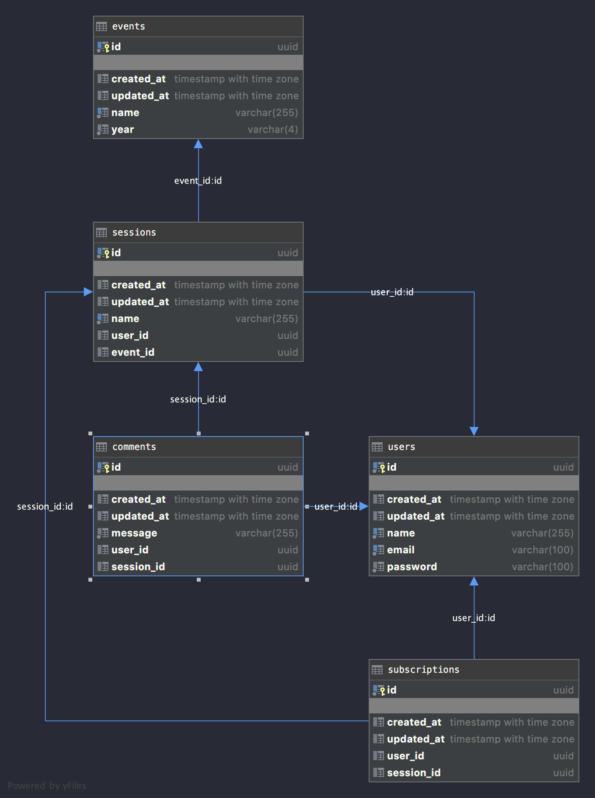

# e2e-rest
End to end sample application implemented in Go using REST APIs and PostgreSQL for persistency

# Used libraries
[GORM](https://gorm.io) - ORM library for Golang

[gorilla/mux](https://github.com/gorilla/mux) - HTTP request multiplexer, part of Gorilla web toolkit

[jwt-go](github.com/dgrijalva/jwt-go) - Implementation of JSON Web Tokens

[wait-for-it](https://github.com/vishnubob/wait-for-it) - used in docker-compose

# Data Model


# Test execution 

## Using docker-compose (fast)

Start command:

```
make e2e-test
```

This will execute following sequence using docker-compose:
- prepare docker image with sources and tests
- start of postgre in container 
- execute tests against postgre in container
- tear down all started docker images

## Manual (slow)

Start test postgre instance:
```
docker run --name postgres_test -p 5433:5432 -e POSTGRES_PASSWORD=postgres -e POSTGRES_USER=postgres -d postgres
```
Start tests:
```
go test ./...
```

# Explore

## Using docker-compose (fast)

Start command:

```
docker-compose up 
```

Stop command:

```
docker-compose down 
```

## Manual (slow)

Start:

```
docker run --name postgres -p 5432:5432 -e POSTGRES_PASSWORD=postgres -e POSTGRES_USER=postgres -d postgres
go run main.go
```

## Create user

`POST` to http://127.0.0.1:8080/users

with payload:
```
{
	"name":"John Smith",
	"email":"john.smith@mymail.local", 
	"password": "secret007"
}
```
## Get token

`POST` to http://127.0.0.1:8080/login

with payload:
```
{
	"email":"john.smith@mymail.local", 
	"password": "secret007"
}
```
## Get all users

`GET` to http://127.0.0.1:8080/users

using authentication with Bearer Token 

## Get single user

`GET` to http://127.0.0.1:8080/users/{id}

using authentication with Bearer Token 

## Update user

`PUT` to http://127.0.0.1:8080/users/{id}

with payload:
```
{
	"name":"John Smith2",
	"email":"john.smith@mymail.local", 
	"password": "secret007"
}
```
using authentication with Bearer Token 

## Delete user

`DELETE` http://127.0.0.1:8080/users/{id}

using authentication with Bearer Token 

...

Use the same schema and for all other objects.

# Acknowledgements
Article ["CRUD RESTful API with Go, GORM, JWT, Postgres, Mysql, and Testing"](https://levelup.gitconnected.com/crud-restful-api-with-go-gorm-jwt-postgres-mysql-and-testing-460a85ab7121) by Steven Victor

Article ["Integration Testing in Go"](https://www.ardanlabs.com/blog/2019/03/integration-testing-in-go-executing-tests-with-docker.html) by George Shaw, that prove this was doable

Docker compose [detailed documentation](https://docs.docker.com/compose/)

